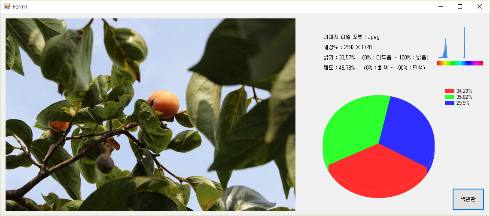
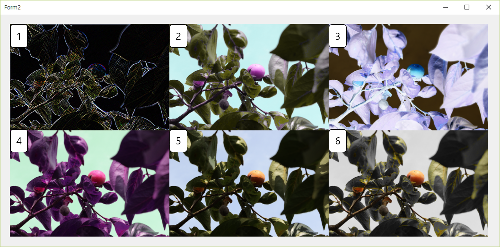

# 프로그램 소개 (PhotoAnalysis)

	* Programs that analyze a image or a photo data.
	* .NETFramework 4.5.2버전을 이용하여 제작한 이미지 분석 프로그램입니다.
	* 이미지의 파일 형식, 해상도, 색분포, 채도, 밝기 등의 데이터를 수치화하여 보여줍니다.
	* [색변환] 버튼을 클릭하면, 원본 이미지를 여러 방법으로 필터링하여 6개의 이미지로 변환하여 출력합니다.

# 실행화면

 * HUE 스펙트럼을 기준으로한 히스토그램
 
 * RGB 비율 그래프
 	* 모든 픽셀의 RGB값을 따로 분리하여 총합을 구한 뒤 비율로 표현한 그래프.
	
	

	1. 외곽선 추출 (Edge Detection)
	2. Red → Magenta, Green → Yellow, Blue → Cyan
	3. 색 반전 (Inverse)
	4. 색 임의 교환(Random Trade) (예: Red → Green, Blue → Red)
	5. 색 강조 (Highlight)
	6. 색상 임의 검출 (Random Tracking)
